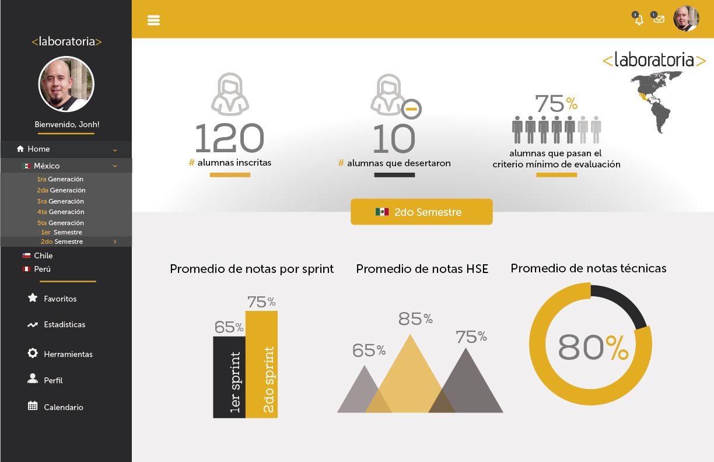

# Página de Laboratoria
A continuación se explica qué partes conforman el UX y qué partes el UI de
la página principal de laboratoria:

## Elementos de navegación de gitHub
A continuación se identifican los elementos de navegación en el site de gitHub:

### Elementos de navegación de gitHub
A continuación se presenta un sketch para la herramienta del dashboard de Laboratoria:

